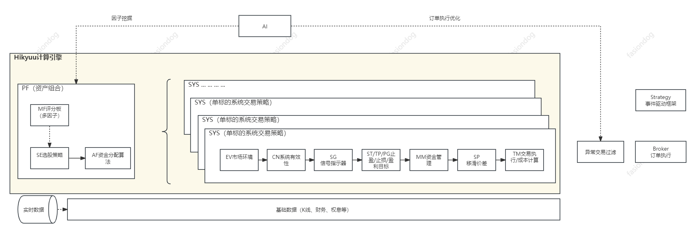

---

     

Hikyuu Quant Framework是一款基于C++/Python的开源量化交易研究框架，用于策略分析及回测（目前主要用于国内A股市场）。专注于量化交易领域的核心技术构建，涵盖**交易模型开发、极速计算引擎、高效回测框架及实盘拓展能力**。其核心思想基于当前成熟的系统化交易方法，将整个系统化交易抽象为由市场环境判断策略、系统有效条件、信号指示器、止损/止盈策略、资金管理策略、盈利目标策略、移滑价差算法等组件，你可以分别构建这些组件的策略资产库，在实际研究中对它们自由组合来观察系统的有效性、稳定性以及单一种类策略的效果。

安装及使用，请先看帮助文档，谢谢！

👉 **项目地址：**

* [https://github.com/fasiondog/hikyuu](https://github.com/fasiondog/hikyuu)
* [https://gitee.com/fasiondog/hikyuu](https://gitee.com/fasiondog/hikyuu)
* [https://gitcode.com/hikyuu/hikyuu](https://gitcode.com/hikyuu/hikyuu)

👉 **项目首页：**[https://hikyuu.org/](https://hikyuu.org/)

👉 **帮助文档：**[https://hikyuu.readthedocs.io/zh-cn/latest/index.html](https://hikyuu.readthedocs.io/zh-cn/latest/index.html)

👉 **入门示例:**  [https://nbviewer.org/github/fasiondog/hikyuu/blob/master/hikyuu/examples/notebook/000-Index.ipynb?flush_cache=True](https://nbviewer.org/github/fasiondog/hikyuu/blob/master/hikyuu/examples/notebook/000-Index.ipynb?flush_cache=True)

👉 **策略部件库：**[https://gitee.com/fasiondog/hikyuu_hub](https://gitee.com/fasiondog/hikyuu_hub)

👉 感谢网友提供的 Hikyuu Ubuntu虚拟机环境, 百度网盘下载(提取码: ht8j): [https://pan.baidu.com/s/1CAiUWDdgV0c0VhPpe4AgVw?pwd=ht8j](https://pan.baidu.com/s/1CAiUWDdgV0c0VhPpe4AgVw?pwd=ht8j)

示例：

```python
    #创建模拟交易账户进行回测，初始资金30万
    my_tm = crtTM(init_cash = 300000)

    #创建信号指示器（以5日EMA为快线，5日EMA自身的10日EMA作为慢线，快线向上穿越慢线时买入，反之卖出）
    my_sg = SG_Flex(EMA(CLOSE(), n=5), slow_n=10)

    #固定每次买入1000股
    my_mm = MM_FixedCount(1000)

    #创建交易系统并运行
    sys = SYS_Simple(tm = my_tm, sg = my_sg, mm = my_mm)
    sys.run(sm['sz000001'], Query(-150))
```


完整示例参见：[https://nbviewer.jupyter.org/github/fasiondog/hikyuu/blob/master/hikyuu/examples/notebook/000-Index.ipynb?flush_cache=True](https://nbviewer.jupyter.org/github/fasiondog/hikyuu/blob/master/hikyuu/examples/notebook/000-Index.ipynb?flush_cache=True)

# 为什么选择 Hikyuu？

* **组合灵活，分类构建策略资产库** Hikyuu对系统化交易方法进行了良好的抽象：市场环境判断策略、系统有效条件、信号指示器、止损/止盈策略、资金管理策略、盈利目标策略、移滑价差算法、交易对象选择策略、资金分配策略。可以在此基础上构建自己的策略库，并进行灵活的组合和测试。在进行策略探索时，可以更加专注于某一方面的策略性能与影响。其主要功能模块如下：
* **性能保障，打造自己的专属应用** 目前项目包含了3个主要组成部分：基于C++的核心库、对C++进行包装的Python库(hikyuu)、基于Python的交互式工具。
  * AMD 7950x 实测：A股全市场（1913万日K线）仅加载全部日线计算 20日 MA 并求最后 MA 累积和，首次执行含数据加载 耗时 6秒，数据加载完毕后计算耗时 166 毫秒，详见: [性能实测](https://mp.weixin.qq.com/s?__biz=MzkwMzY1NzYxMA==&mid=2247483768&idx=1&sn=33e40aa9633857fa7b4c7ded51c95ae7&chksm=c093a09df7e4298b3f543121ba01334c0f8bf76e75c643afd6fc53aea1792ebb92de9a32c2be&mpshare=1&scene=23&srcid=05297ByHT6DEv6XAmyje1oOr&sharer_shareinfo=b38f5f91b4efd8fb60303a4ef4774748&sharer_shareinfo_first=b38f5f91b4efd8fb60303a4ef4774748#rd)
  * C++核心库，提供了整体的策略框架，在保证性能的同时，已经考虑了对多线程和多核处理的支持，在未来追求更高运算速度提供便利。C++核心库，可以单独剥离使用，自行构建自己的客户端工具。
  * Python库（hikyuu），提供了对C++库的包装，同时集成了talib库（如TA_SMA，对应talib.SMA），可以与numpy、pandas数据结构进行互相转换，为使用其他成熟的python数据分析工具提供了便利。
  * hikyuu.interactive 交互式探索工具，提供了K线、指标、系统信号等的基本绘图功能，用于对量化策略的探索和回测。
* **代码简洁，探索更便捷、自由** 同时支持面向对象和命令行编程范式。其中，命令行在进行策略探索时，代码简洁、探索更便捷、自由。
* **安全、自由、隐私，搭建自己的专属云量化平台** 结合 Python + Jupyter 的强大能力与云服务器，可以搭建自己专属的云量化平台。将Jupyter部署在云服务器上，随时随地的访问自己的云平台，即刻实现自己新的想法，如下图所示通过手机访问自己的云平台。结合Python强大成熟的数据分析、人工智能工具（如 numpy、scipy、pandas、TensorFlow)搭建更强大的人工智能平台。
* **数据存储方式可扩展** 目前支持本地HDF5格式、MySQL存储。默认使用HDF5，数据文件体积小、速度更快、备份更便利。截止至2017年4月21日，沪市日线数据文件149M、深市日线数据文件184M、5分钟线数据各不到2G。


# 想要更多了解Hikyuu？请使用以下方式联系：

## [VIP捐赠-附属功能](https://hikyuu.readthedocs.io/zh-cn/latest/vip/vip-plan.html)

## **加入知识星球**

更多示例与程序化交易的分享（您的加入将视为对项目的捐赠）。**作者只保证对知识星球用户有问必答，其他渠道视情况。**


## 关注公众号：


## 加入微信群（请注明“加入hikyuu”）：


## QQ交流群：114910869, 或扫码加入（微信为主)


## 项目依赖说明

Hikyuu C++部分直接依赖以下开源项目（由以下项目间接依赖的项目及 python 项目未列出， python依赖项目请参考 requirements.txt），感谢所有开源作者的贡献：

| 名称          | 项目地址                                                                    | License                                                                               |
| ------------- | --------------------------------------------------------------------------- | ------------------------------------------------------------------------------------- |
| xmake         | [https://github.com/xmake-io/xmake](https://github.com/xmake-io/xmake)         | Apache 2.0                                                                            |
| hdf5          | [https://github.com/HDFGroup/hdf5](https://github.com/HDFGroup/hdf5)           | [hdf5 license](https://github.com/HDFGroup/hdf5?tab=License-1-ov-file#License-1-ov-file) |
| mysql(client) | [https://github.com/mysql/mysql-server]()                                      | [mysql license](https://github.com/mysql/mysql-server?tab=License-1-ov-file#readme)      |
| fmt           | [https://github.com/fmtlib/fmt](https://github.com/fmtlib/fmt)                 | [fmt license](https://github.com/fmtlib/fmt?tab=License-1-ov-file#readme)                |
| spdlog        | [https://github.com/gabime/spdlog](https://github.com/gabime/spdlog)           | MIT                                                                                   |
| sqlite        | [https://www.sqlite.org/](https://www.sqlite.org/)                             | [sqlite license](https://www.sqlite.org/copyright.html)                                  |
| flatbuffers   | [https://github.com/google/flatbuffers](https://github.com/google/flatbuffers) | Apache 2.0                                                                            |
| nng           | [https://github.com/nanomsg/nng](https://github.com/nanomsg/nng)               | MIT                                                                                   |
| nlohmann_json | [https://github.com/nlohmann/json](https://github.com/nlohmann/json)           | MIT                                                                                   |
| boost         | [https://www.boost.org/](https://www.boost.org/)                               | [Boost Software License](https://www.boost.org/users/license.html)                       |
| python        | [https://www.python.org/](https://www.python.org/)                             | [Python license](https://docs.python.org/3/license.html)                                 |
| pybind11      | [https://github.com/pybind/pybind11](https://github.com/pybind/pybind11)       | [pybind11 license](https://github.com/pybind/pybind11?tab=License-1-ov-file#readme)      |
| gzip-hpp      | [https://github.com/mapbox/gzip-hpp](https://github.com/mapbox/gzip-hpp)       | BSD-2-Clause license                                                                  |
| doctest       | [https://github.com/doctest/doctest](https://github.com/doctest/doctest)       | MIT                                                                                   |
| ta-lib        | [https://github.com/TA-Lib/ta-lib.git]()                                       | BSD-3-Clause license                                                                  |
| clickhouse    | [https://github.com/ClickHouse/ClickHouse]()                                   | Apache 2.0                                                                            |
| xxhash        | [https://github.com/Cyan4973/xxHash]()                                         | BSD 2-Clause License                                                                  |
| utf8proc      | [https://github.com/JuliaStrings/utf8proc]()                                   | MIT                                                                                   |
| arrow         | [https://github.com/apache/arrow]()                                            | Apache 2.0                                                                            |
